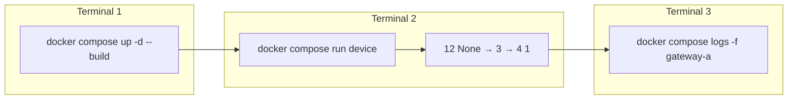

# SpeedyChain + Stordy


**SpeedyChain** é um protótipo de blockchain para dispositivos IoT. Esta branch integra o módulo de armazenamento **Stordy** (submódulo Git) e oferece dois modos de execução:

- **Docker** — dois gateways (`gwa` e `gwb`) com storage isolado, name server Pyro4 e device simulador
- **VPS** — instalação nativa em Linux, sem containers (instruções abaixo)

## Arquitetura

| Componente | Porta / identificador | Função |
|------------|----------------------|--------|
| Name server (Pyro4) | `9090` | Registro de gateways e devices |
| Gateway A | `gwa` | Nó de entrada com blockchain |
| Gateway B | `gwb` | Segundo gateway (testes multi-gateway) |
| Stordy | gRPC `50052` | Persistência de blocos e transações |
| Device simulador | `dev-a` (padrão) | Menu interativo de testes |

## Obter o código

```bash
git clone --recurse-submodules -b feat/complete-version git@github.com:conseg/speedychain.git
cd speedychain
```

Se já clonou sem submódulos:

```bash
git submodule update --init --recursive
```

---

## Execução via Docker

Recomendado para testar **dois gateways com storage isolado** (cada um com seu próprio Stordy).

### Pré-requisitos

- Docker e Docker Compose
- Submódulo `stordy/` inicializado (ver acima)

### 1. Subir os containers

Na raiz do repositório:

```bash
docker compose up -d --build
```

Isso inicia:

- `name-server` na porta **9090**
- `gateway-a` (`gwa`) com dados em `./volumes/gwa`
- `gateway-b` (`gwb`) com dados em `./volumes/gwb`

Verifique que os serviços estão rodando:

```bash
docker compose ps
```

Todos devem aparecer como `Up`.

#### Ambiente limpo (primeira execução ou reset)

```bash
docker compose down
rm -rf ./volumes/gwa/* ./volumes/gwb/*
docker compose up -d --build
```

### 2. Abrir o device

Em um **segundo terminal**, execute o simulador em foreground:

```bash
docker compose --profile interactive run --rm device
```

Por padrão o device conecta ao gateway `gwa` (`DEVICE_NAME=dev-a`). O entrypoint aguarda o gateway registrar no name server antes de abrir o menu.

Para usar outro gateway:

```bash
docker compose --profile interactive run --rm \
  -e GATEWAY_NAME=gwb -e DEVICE_NAME=dev-b device
```

### 3. Fluxo mínimo de teste

No menu do device, execute nesta ordem:

| Passo | Opção | Entrada | O que faz |
|-------|-------|---------|-----------|
| 1 | **12** | `None` | Define consenso sem algoritmo |
| 2 | **3** | *(Enter)* | Autenticação — cria bloco do device e obtém chave AES |
| 3 | **4** | `1` | Envia 1 transação (sensor simulado) |
| 4 | **5** | *(opcional)* | Lista blocos; o bloco do device deve mostrar `Number of transactions: 1` |

Evite a opção **8** (`Recreate Device KeyPair`) no primeiro teste — ela invalida a chave AES obtida na opção 3.

### 4. Acompanhar transações

A opção **6** (`List Transactions`) imprime no **gateway**, não no terminal do device (comportamento do Pyro4). Para ver as transações adicionadas, use um **terceiro terminal**:

```bash
docker compose logs -f gateway-a
```

Após a opção 4, procure mensagens como `addTransaction`, `Block Ledger size` e os dados das transações.

### 5. Encerrar

```bash
docker compose down
```

Os dados da blockchain permanecem em `./volumes/gwa` e `./volumes/gwb`.

### Fluxo resumido (Docker)



### Troubleshooting (Docker)

Para erros comuns (`unknown name: gwa`, rebuild, Apple Silicon, GLIBC), consulte [docker/README.md](docker/README.md).

---

## Execução em VPS (sem Docker)

Instruções para instalação nativa em Linux (Ubuntu/Debian). Neste modo, **dois gateways na mesma máquina compartilham um único Stordy** (porta fixa `50052`). Para storage isolado por gateway, use a seção Docker ou duas VPS distintas.

### Pré-requisitos

```bash
sudo apt update && sudo apt upgrade -y
sudo apt install -y git python3-pip cargo protobuf-compiler \
  gcc g++ make libffi-dev libssl-dev python2
```
##### Instalação alternativa do Python 2
Caso não consiga instalar o python2 com o comando anterior, instale com o Pyenv [tutorial aqui](InstalPython2.md) (ele provavelmente virá com o pip2).

#### Pip para Python 2

```bash
curl https://bootstrap.pypa.io/pip/2.7/get-pip.py -o get-pip.py
sudo python2 get-pip.py
```

#### Dependências Python

```bash
pip3 install Pyro4 (meio que não precisa do python3, só o python2 é suficiente)
pip2 install Pyro4 Flask merkle cryptography requests colorlog protobuf psutil grpcio==1.39.0
```

### Obter o código

TODO: talvez mudar a url para https

```bash
git clone --recurse-submodules -b complete-ECC git@github.com:conseg/speedychain.git
cd speedychain
```

Se já clonou sem submódulos:

```bash
git submodule update --init --recursive
```

### Layout de terminais

Abra **cinco terminais** na raiz do repositório:

TODO: retirar o python3 do tutorial

| Terminal | Comando | Notas |
|----------|---------|-------|
| T1 | `python3 -m Pyro4.naming -n 0.0.0.0 -p 9090` | Name server |
| T2 | `cd stordy && cargo run --release` | Stordy (porta 50052) |
| T3 | `cd API && python2 runner.py -n 127.0.0.1 -p 9090 -G gwa -C 0001 -S 1` | Gateway A |
| T4 | `cd API && python2 runner.py -n 127.0.0.1 -p 9090 -G gwb -C 0001 -S 1` | Gateway B (compartilha o mesmo Stordy) |
| T5 | `cd API && python2 src/tools/DeviceSimulator.py 127.0.0.1 9090 gwa dev-a` | Device simulador |

Aguarde o Stordy exibir `Stordy initialize!!` e os gateways registrarem no name server (`SpeedyCHAIN Gateway initialized`) antes de inicializar o device (T5).

### Fluxo mínimo de teste (VPS)

No menu do device (T5), use o mesmo fluxo da seção Docker:

1. Opção **12** → `None`
2. Opção **3** → *(Enter)*
3. Opção **4** → `1`
4. Opção **5** → *(opcional)* para listar blocos

### Limitação multi-gateway na VPS

O binário Stordy escuta em `0.0.0.0:50052` e usa diretórios relativos `blocks/` e `transactions/`. Na mesma máquina, apenas **uma** instância pode rodar. Os dois gateways (T3 e T4) compartilham esse storage.
Outros gateways além do primeiro apresentarão erros ao tentar inserir blocos e transações, esse é um comportamente esperado, pois já estão armazenados localmente.

Para **dois gateways com dados isolados** (como no Docker), use `docker compose` ou execute cada par gateway+stordy em **VPS separadas**, com o name server acessível por rede.

---

## Referências opcionais

- **EVM (Go Ethereum)** — integração opcional para testes com smart contracts; ver scripts em `API/quickstart.sh`
- **P2P** — script `API/P2P.py` para rede peer-to-peer (cenários avançados)
- **CORE Emulator** — [tutorial em vídeo](https://www.youtube.com/watch?v=xCGu3r73xl4)

---

## Glossário

- **Node** — ponto na rede SpeedyChain que se comunica com outros nós
- **Gateway** — ponto de entrada que conecta devices à blockchain
- **Stordy** — módulo de armazenamento (Rust/gRPC) integrado aos gateways
- **Device** — dispositivo IoT simulado que envia transações
